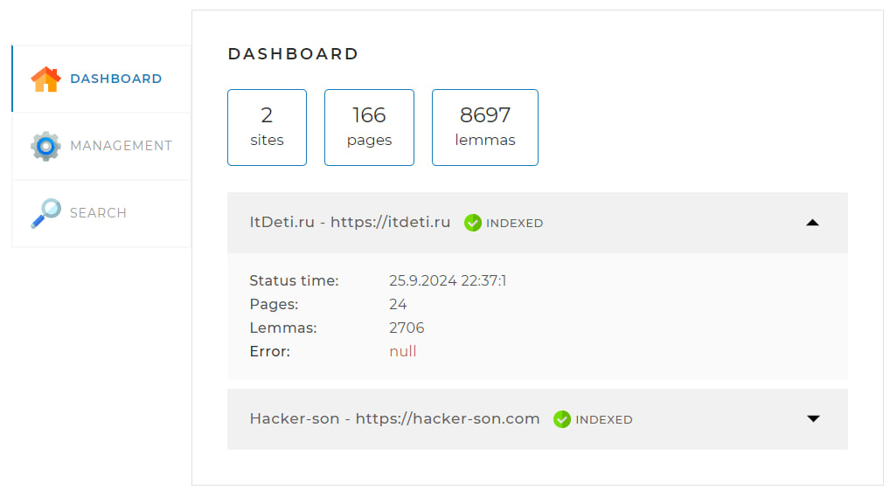
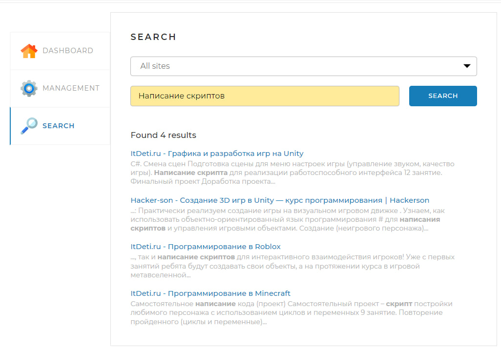

# Поискновый движок

Данное приложение представляет собой поисковый движок, реализованный в виде Spring-приложения.
Основной целью разработки данного приложения является создание системы, которая позволяет пользователям быстро находить необходимую информацию по ключевым словам через поле поиска.

## Версия 1.0

## Установка приложения
Минимальный стек приложений и технологий, который должен у вас быть для запуска приложения:
1. Docker
2. Java 17
3. Maven
4. Любая среда разработки

### Клонирование проекта
```bash
 git clone https://github.com/RomanZemchenkov/Site-Analyzer.git
```

### Сборка проекта
```bash
 mvn clean package -DskipTests
```

### Создание Docker образа
```bash
 docker build -t sentencesearcher:1.0 .
```

### Запуск Docker-образа
```bash
 cd docker
 docker-compose up --build
```

## Функционал
* Индексация сайтов, находящися в application.properties файле приложения

* Добавление или обновление страниц для сайтов

* Поиск по индексированным сайтам с возможностью фильтрации по сайту

* При желании, после запуска индексации вы можете её остановить и тогда вы сможете совершать поиск только по тем страницам, которые уже были изучены


## Стек используемых технологий
* Java 17
* Spring Boot
* Spring Data Jpa
* PostgreSQL
* Liquibase
* Lucene Morphology

